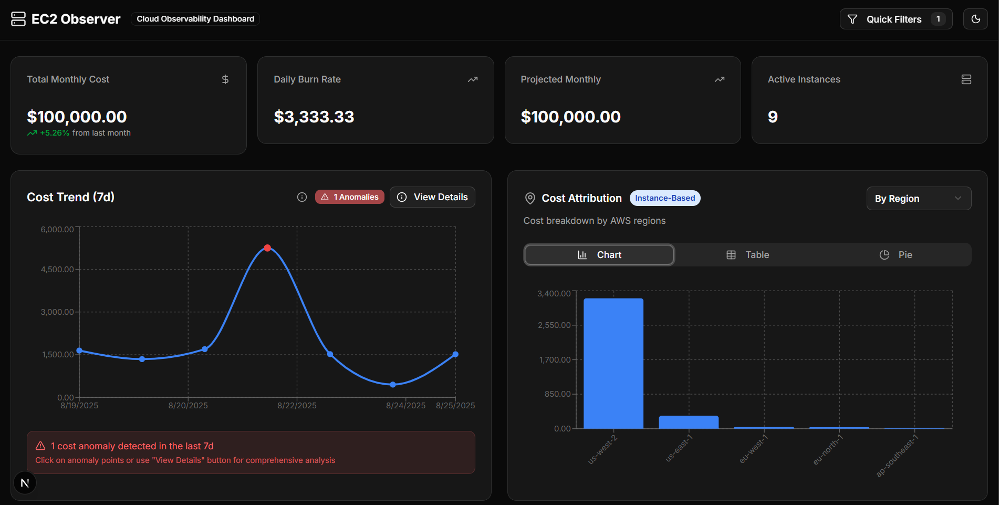
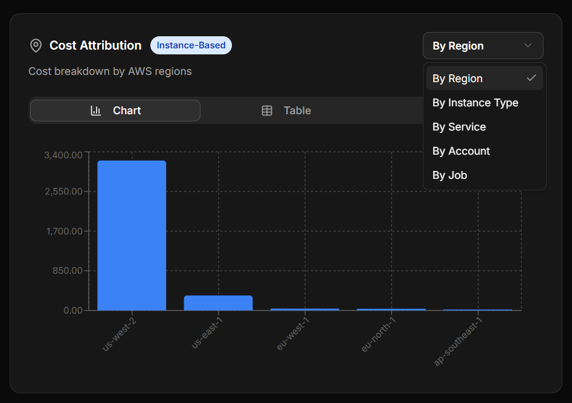
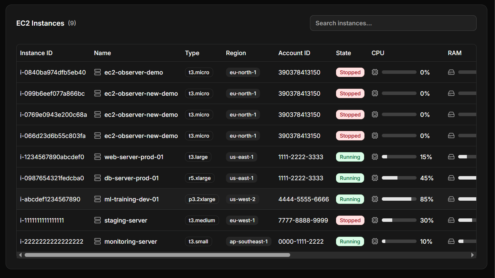
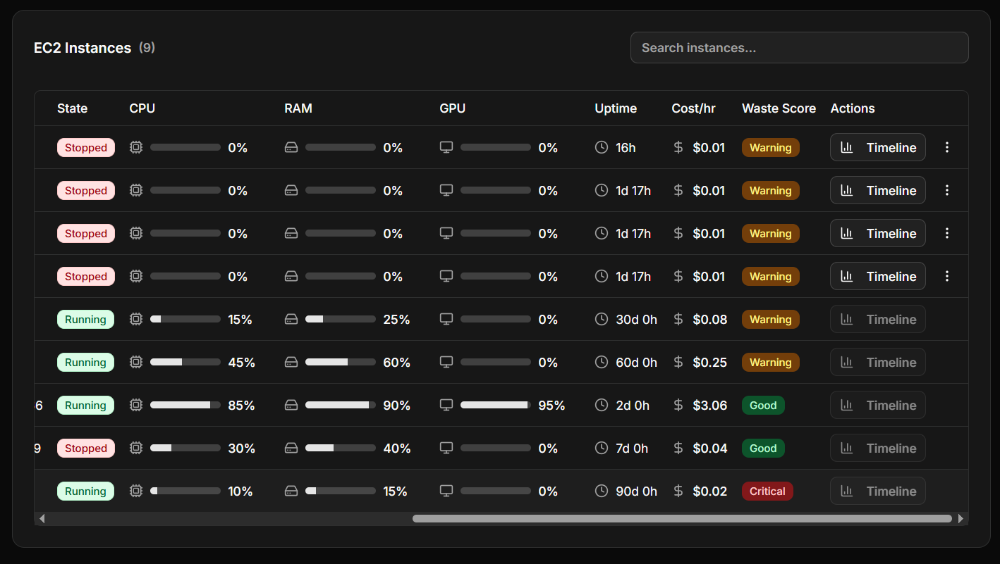
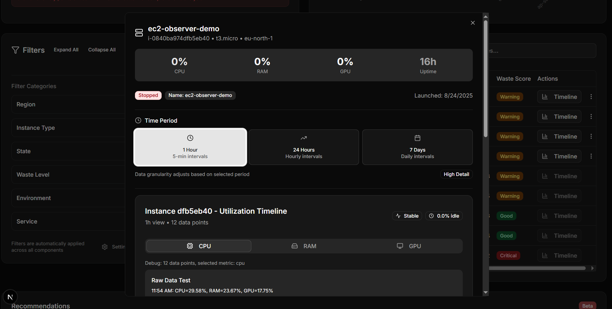
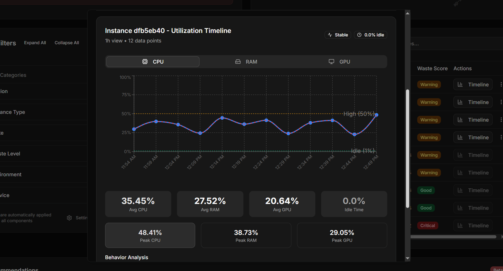
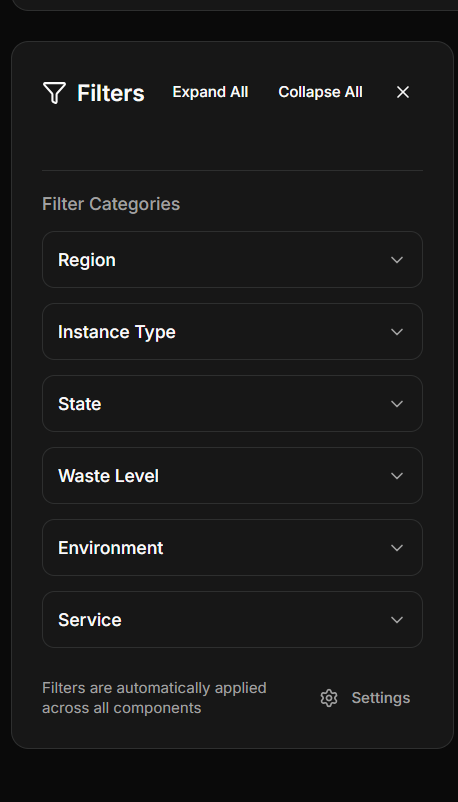
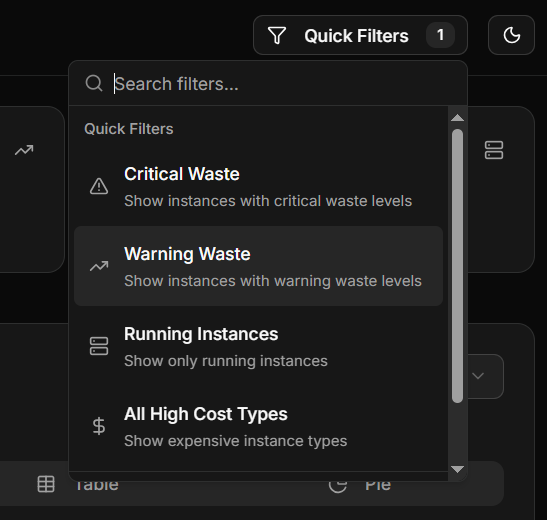
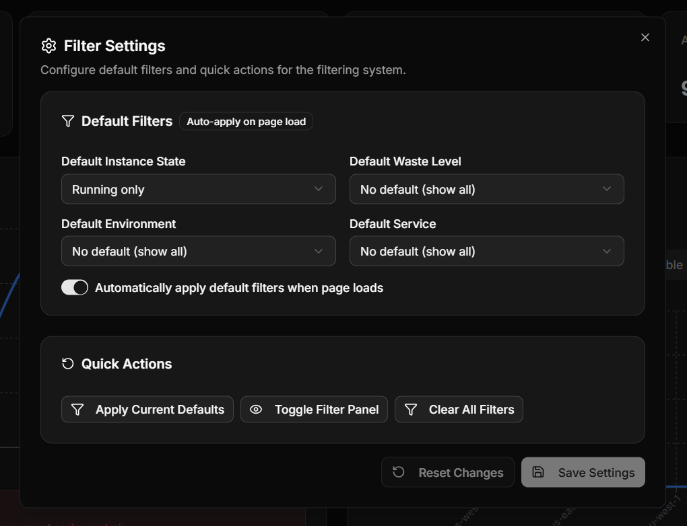
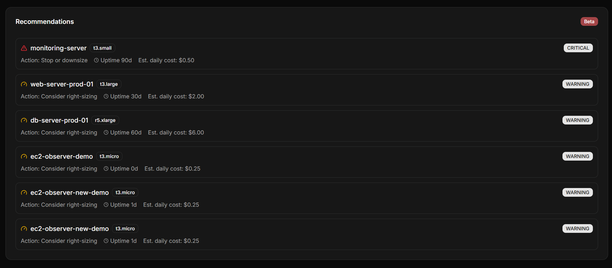

# EC2 Cost Observability Dashboard - Technical Write-Up

## Summary

This document outlines the technical implementation of an EC2 cost observability dashboard designed for bioinformatics teams. The application provides real-time cost monitoring, waste detection, and actionable insights for AWS EC2 infrastructure management.

## Design Decisions & Aesthetic Choices

### 1. Information Architecture

- **Top-down hierarchy**: KPIs → Trends → Attribution → Detailed Table → Recommendations
- **Progressive disclosure**: Critical metrics visible immediately, detailed analysis available on demand
- **Consistent data flow**: All components share the same filter state for cohesive user experience

### 2. Visual Design Tradeoffs

**Chosen: Information Density over Minimalism**

- Wide tables with inline drilldowns allow power users to scan 20+ instances simultaneously
- Multi-column layout maximizes screen real estate for data-heavy workflows

**Chosen: Color-coded Waste Scoring**

- Red/amber/green waste indicators provide instant visual scanning
- Tooltips explain waste reasons without cluttering the interface

**Chosen: Inline Timeline Modals**

- Wide, two-column timeline view when clicking instance names
- Preserves context while providing detailed historical data

**Chosen: Simplified Cost Attribution**

- Removed confusing drilldown behavior and nested tables
- Clear dimension selector with descriptive labels and icons
- Default to bar chart view for better data visualization
- Tradeoff: Less "advanced" features but much more intuitive UX

### 3. Technical Architecture Decisions

**React Query + Server State Management**

- Automatic caching, background refetching, and optimistic updates
- Reduces perceived latency and improves user experience
- Tradeoff: Additional complexity but essential for real-time feel

**Mock Data Fallbacks**

- Graceful degradation when AWS APIs are unavailable
- Maintains development velocity and demo capability
- Tradeoff: Potential confusion between real/mock data - mitigated with clear indicators

## User & System Assumptions

### Primary User Persona: Bioinformatics Researchers

- **Technical fluency**: Comfortable with AWS concepts, instance types, and cost terminology
- **Time constraints**: Prefer fast, precise controls over guided wizards
- **Data-driven decisions**: Need quantitative evidence for cost optimization
- **Collaborative workflows**: Share cost insights across research teams

### System Assumptions

- **AWS environment**: Standard EC2, CloudWatch, and Cost Explorer setup
- **Network reliability**: Intermittent connectivity to AWS APIs
- **Data volume**: 10-1000 EC2 instances per organization
- **Update frequency**: 5-15 minute refresh cycles are acceptable

### Workflow Assumptions

- Users start with high-level cost overview, then drill into specific instances
- Anomaly detection triggers investigation workflows
- Cost attribution helps justify resource allocation to stakeholders
- Recommendations guide immediate optimization actions

## Feature Not Built: Real-time WebSocket Updates

**Decision**: Implemented polling-based updates instead of WebSocket connections

**Rationale**:

1. **Simplicity**: Polling with React Query provides sufficient real-time feel without WebSocket complexity
2. **Reliability**: HTTP polling is more resilient to network issues than persistent WebSocket connections
3. **AWS API limitations**: Cost Explorer and CloudWatch APIs don't support real-time streaming
4. **Development velocity**: Focused on core functionality over real-time infrastructure

**Future consideration**: The API structure supports adding WebSockets later without major refactoring

## Screenshots of Working UI

The following screenshots demonstrate the dashboard in action with simulated data:


_Complete dashboard showing KPIs, cost trends, attribution charts, and EC2 table with waste indicators_


_Multi-dimensional cost breakdown with interactive dimension selector (Region/Instance Type/Service/Account/Job)_




_EC2 instances table featuring color-coded waste scoring and inline drilldown capabilities_




_Detailed instance timeline view showing CPU and memory utilization over time_






_Global filter system affecting all dashboard components simultaneously_


_Cost optimization recommendations with potential savings and quick filter actions_

## Technical Implementation Highlights

### 1. Multi-factor Waste Scoring Algorithm

```typescript
// Combines CPU, memory, and cost efficiency into weighted score
const wasteScore =
  (cpuUtil * 0.4 + memoryUtil * 0.3 + costEfficiency * 0.3) * 100;
```

### 2. Intelligent Data Reconciliation

- Merges real AWS data with mock fallbacks seamlessly
- Deduplicates and sorts time-series data for consistent visualization
- Handles missing data points

### 3. Responsive Filter System

- Global filter state shared across all components
- URL-encoded parameters for shareable filtered views
- Optimistic UI updates with background validation

### 4. Accessibility Considerations

- ARIA labels and keyboard navigation support
- High contrast waste indicators
- Screen reader friendly data tables

## Performance Optimizations

- **React Query caching**: Reduces API calls and improves perceived performance
- **Virtualized tables**: Handles large instance lists efficiently
- **Lazy loading**: Charts and detailed views load on demand
- **Optimistic updates**: UI responds immediately to user actions

## Security & Compliance

- **No sensitive data storage**: All AWS credentials handled server-side
- **Read-only access**: Dashboard provides visibility without modification capabilities
- **Audit trail**: All cost data queries logged for compliance

## Future Enhancements

1. **Real-time WebSocket updates** (when AWS APIs support it)
2. **Cost forecasting** with ML-based predictions
3. **Automated optimization recommendations** with one-click implementation
4. **Multi-cloud support** (GCP, Azure)
5. **Advanced anomaly detection** with customizable thresholds

## Conclusion

The dashboard successfully balances technical sophistication with usability, providing bioinformatics teams with the cost visibility they need while maintaining the performance and reliability required for production environments. The modular architecture supports future enhancements while delivering immediate value through actionable cost insights.

---

**Technical Stack**: Next.js 15, React Query, TypeScript, Tailwind CSS, shadcn, AWS SDK  
**Deployment**: Vercel-ready with environment-based configuration
